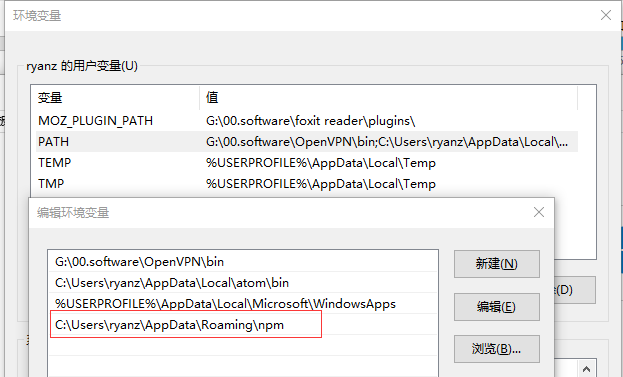
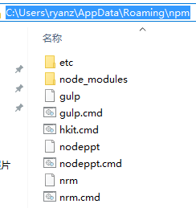

## 初始化package.json
```
npm init      // 配置
npm init -y   // 默认配置
```

## 安装模块
- 全局安装(命令行下使用)
    ```js
    npm install <package_name> -g
    ```
    在npm中配置一个快捷方式 指向到真正的文件
    因为npm在path中所有这个快捷方式也可以直接使用
    

    
    eg: nrm.cmd文件内容如下:
    ```
    @IF EXIST "%~dp0\node.exe" (
      "%~dp0\node.exe"  "%~dp0\node_modules\nrm\cli.js" %*
    ) ELSE (
      @SETLOCAL
      @SET PATHEXT=%PATHEXT:;.JS;=;%
      node  "%~dp0\node_modules\nrm\cli.js" %*
    )
    ```
- 本地安装(在当前文件下使用)
    + npm install <package_name>
        不会更新package.json文件,需要手动更新
    + 依赖--save 自动把模块和版本号添加到dependencies部分
        ```js
        npm install jquery angular --save
        ```
    + 开发依赖 上线后不再需要了 --save-dev 自动把模块和版本号添加到devDependencies部分
        ```js
        npm install gulp --save-dev
        ```

##卸载模块
install改成uninstall,怎么装怎么卸

##切换源
- 安装nrm包
    ```
    npm install nrm -g
    ```

- 显示所有源
    ```
    nrm ls
    ```

- 测试源的网速
    ```
    nrm test           // 测试各个源的网速
    nrm test cnpm      // 测试cnpm的网速
    ```

- 切换源
    ```
    nrm use <name>
    ```

##发布包
- 要创建账号有的话可以直接登陆
    ```
    npm adduser
    ```
- 创建账号
    ```
    npm whoami
    ```
- 发布
    ```js
    npm publish
    ```

## require('xxx');
会找node_modules文件夹 找对应的xxx文件名
先找文件里是否包含index.js index.json ,会查找package.json里对应的main字段，
找到对应的执行文件，如果没有像上级查找，直到根目录结束，如果没有报错
```js
module.paths; //查找目录的顺序
```
